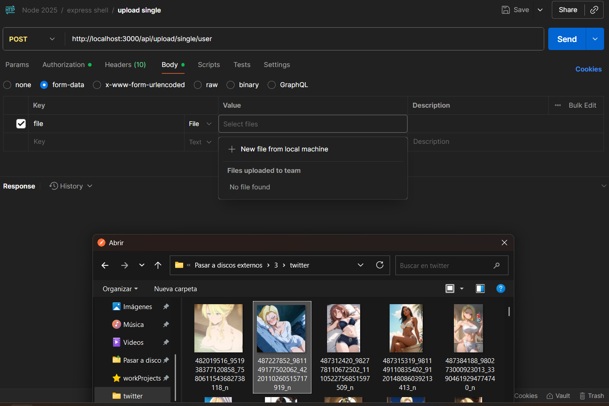
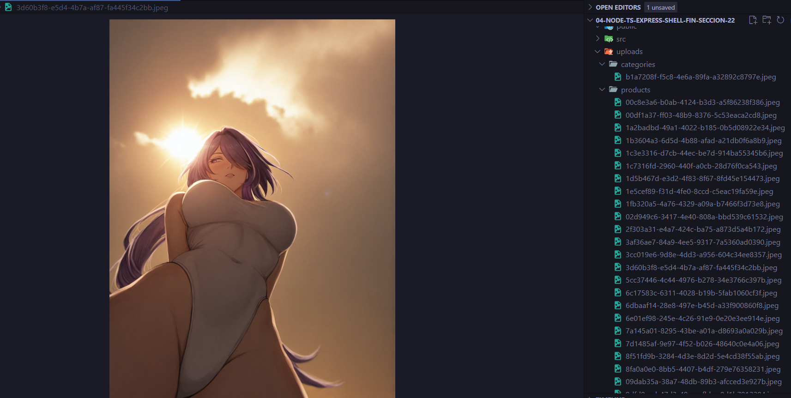

# Rest Project + TypeScript

Este proyecto previamente inicializado tiene todo lo necesario para trabajar con TypeScript, Express y Rest.

Cada paso de su configuración ya se ha realizado previamente en el curso, por lo que solo es necesario clonar el proyecto y comenzar a trabajar.

## El proyecto trata de:
- Registro e inicio de sesion de usuario, contraseñas encriptadas
- JWT
- Uso y administracion de roles
- Enviar correos electronicos de confirmacion del email
- Proteccion de rutas
- Paginacion
- Carga de archives single y multiples

## Instalación

1. Clonar .env.template a .env y configurar las variables de entorno. Obtener Gmail Key: [Google AppPasswords](https://myaccount.google.com/u/0/apppasswords).
2. Ejecutar `npm install` para instalar las dependencias
3. En caso de necesitar base de datos, configurar el docker-compose.yml y ejecutar `docker compose up -d` para levantar los servicios deseados.
4. Llenar la base de datos con los datos de prueba ejecutando `npm run seed`
5. Ejecutar `npm run dev` para levantar el proyecto en modo desarrollo

OPCIONAL:
Instalar nrok para manejar los endpoints desde el celular https://ngrok.com/ luego seguir la documentacion para
configurarlo y correr con `nrok http 3000` en la powershell de windows. Tambien en la consola luego de correrlo aparece un https el cual hay que pegarlo en los environments para ver los webservice de la aplicacion.

## Screenshots

